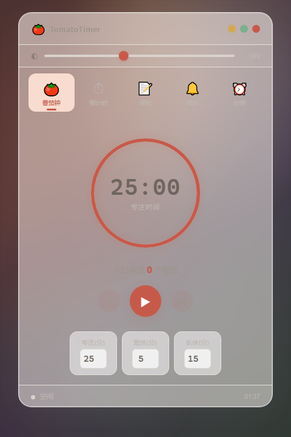

# 🍅 TomatoTimer

一个毛玻璃透明效果的番茄钟桌面工具。

纯 HTML 单文件，双击就能跑。不用装 Node，不用 npm install，不用任何构建工具。

## 长什么样

窗口半透明，能透出背景的彩色光斑。透明度可以用滑块调，最低 15%，基本就是一层薄雾。

## 能干什么

- **番茄钟** — 25 分钟工作 + 5 分钟休息，经典的 Pomodoro 节奏
- **倒计时** — 自己定时长，干啥都行
- **便笺** — 写点备忘、临时想法，数据存 localStorage，关了还在
- **透明度调节** — 滑块控制窗口透明度，从薄雾到全实

## 怎么用

下载 `tomato.html`，用浏览器打开。完事。

推荐用 Chrome 或 Edge。没测过 IE，也不打算测。

## 技术细节

整个工具就一个 HTML 文件，CSS 和 JS 全写在一起。没有外部依赖，没有框架，没有构建步骤。

毛玻璃效果靠 CSS `backdrop-filter: blur()` 实现，透明度用 JS 直接改 `rgba` 的 alpha 通道（因为 CSS 变量不能直接当 `rgba` 的第四个参数用，这是个坑，踩过）。

## 配色

主色调是暖棕色 `#C65A4A`，不是那种冷冰冰的蓝紫色。背景是深暖棕 + 几个高饱和度彩色光斑，这样毛玻璃效果才看得出来。

整个色板：

| 用途 | 色值 |
|------|------|
| 主色 | `#C65A4A` |
| 背景底色 | `#F7F2EC` |
| 浅色点缀 | `#F8DCCF` |
| 正文文字 | `#6F655E` |

## 为什么做这个

市面上的番茄钟工具要么太花哨，要么太丑，要么得装一堆东西。我就想要一个好看的、能调透明度的、双击就能用的。找不到就自己写呗。

## 开源

MIT 协议，随便用。
